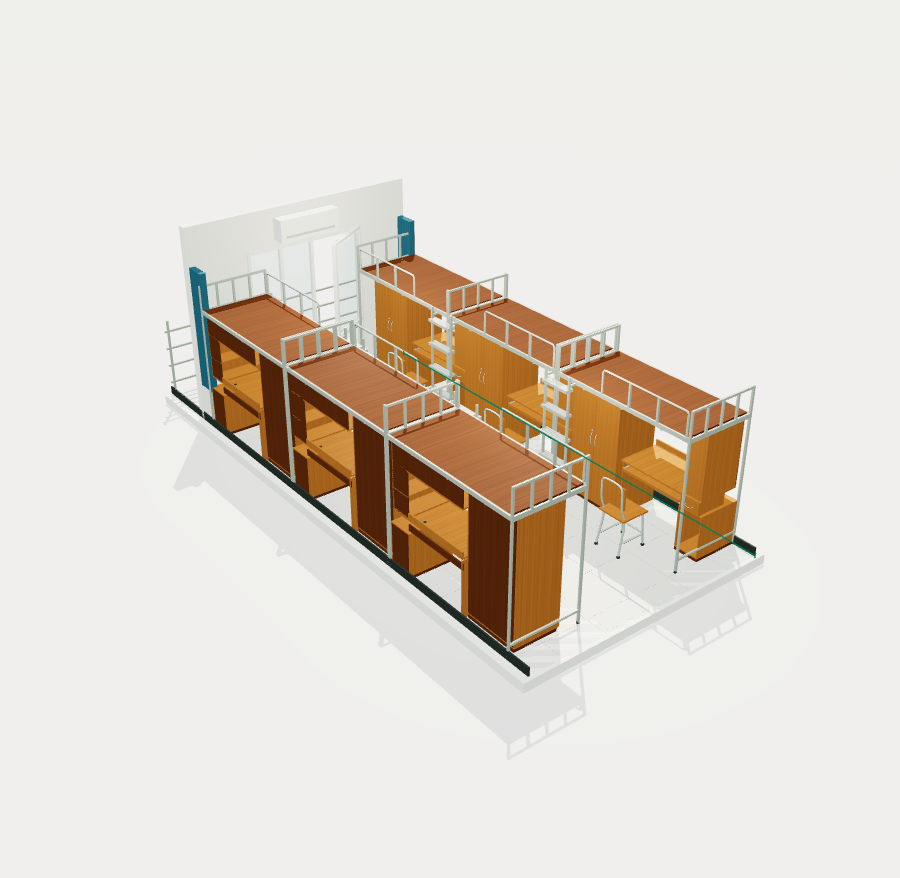

# Dorm3D · 北邮十公寓宿舍建模

根据 9 张宿舍实拍照片、手工测量和用户补充确认，建立六人寝室的本地交互式 3D 模型。

GitHub 仓库：[Holour/Dorm3D](https://github.com/Holour/Dorm3D)。公开仓库包含模型、源代码和尺寸资料，原始照片 `pictures/` 仅在本地保留，不提交。

## 当前成果

- 两侧各三张上床下桌；从入口面向阳台，左侧 1、2、3，右侧 6、5、4。
- 面向各自桌柜时，全部六组均为衣柜在左、侧边书柜在右。
- 室内、独立阳台、床架护栏、四架梯子、衣柜内部分区、书桌、键盘架、抽屉、机柜、侧书柜，以及正常放在桌前的六把椅子。
- 门窗、空调、暖气、灯具、插座与窗帘依据照片近似还原。
- **点击模型部件查询 45 项原始实测尺寸**，注明内尺寸、方向和测量边界；估计值与计算值不进入查询或标签。
- 支持旋转、缩放、平移、整体/俯视/入口/阳台视角、打开衣柜、隐藏上铺、水平剖切、GLB 导出与 PNG 视图保存。
- 支持 WASD / 方向键移动观察位置；新增固定位置的椅上视角，坐姿下用按键或拖动转头，可点击键盘架和衣柜互动。



## 本地运行

需要 Node.js 20.19 或更新版本和支持 WebGL 2 的现代浏览器。本机已完成依赖安装。

Windows 可双击 **启动模型.cmd**。它会在需要时安装锁定依赖、启动服务并打开浏览器；保持终端窗口打开，按 Ctrl+C 停止。

也可以在项目根目录运行：

```powershell
npm ci
npm run dev
```

访问 **http://127.0.0.1:5173/**。已装好依赖时只需第二条命令。第一次安装依赖需要网络；之后运行不依赖外部图床或云服务。

从 GitHub 克隆的副本不含原始照片，三维模型、尺寸查询、剖切和导出均可独立使用。需要照片对照时，可自行将原始 JPG 照片放入本地 `pictures/` 目录；该目录已被 Git 忽略。`dist/` 可能包含本地照片的打包副本，也已排除，不随仓库提交。

如果服务已经运行，直接访问地址即可，无需重复启动。

构建和预览：

```powershell
npm run build
npm run preview
```

预览地址为 **http://127.0.0.1:4173/**。`dist/` 是构建目录，需通过本地 HTTP 服务访问，不能直接双击 HTML 运行。所有服务只绑定本机地址，不对外发布。

不需要账户或 API 密钥。可选端口设置见 `.env.example`，复制为 `.env.local` 后调整；默认端口占用时可改端口，启动日志中的实际地址为准。

## 如何查看尺寸

1. 点击床架、桌面、衣柜等实体，直接显示一条实测标注，并列出该部件的全部记录；也可用床位图和部件下拉框选择。
2. 在“查找具体尺寸”输入“衣柜第二格”“床板厚度”等，点击结果或按 Enter 即可定位。搜索默认使用当前床位，未选床位时使用 1 号；也可输入“三号床 衣柜第二格”。
3. 点选尺寸记录会自动靠近观察。聚焦衣柜会打开柜门，临时隐藏周围床位、梯子和上铺，方便查看内部；用“返回完整空间”或视角按钮恢复。距离范围和公区记录保留原始手工值。
4. “上层床铺”开关便于看桌柜；“水平剖切”滑杆用于观察内部，不显示估计剖切高度。
5. 先点击模型，再按住 WASD 或方向键前后左右移动位置；拖动旋转、滚轮缩放、右键拖动平移，F 聚焦，Esc 重置。输入框、下拉框和照片弹窗中的按键不会移动模型。

## 坐姿与手机操作

- 选择床位后点击“坐到椅子上”，未指定床位时使用 1 号。坐姿固定在对应椅子，W/↑抬头、S/↓低头、A/←左看、D/→右看；鼠标或单指拖动也能环顾，滚轮和拖动不会改变座位位置。
- 坐姿中点击本床键盘架可拉出或收回，点击衣柜可开关柜门。“离开座位”、Esc 或其他观察视角可退出坐姿。
- 手机模型下方可切换“尺寸查询”与“视角与操作”，无需连续翻过两块长面板。坐姿中可长按画面上的四向按钮转头。
- 坐姿下查询仍显示实测记录；需要移动镜头聚焦具体尺寸时，先离开座位。眼点和抽拉行程仅用于交互，不作为实测值展示。

尺寸目录保留原始 45 条记录。用户补充的近似安装位置和框架、挡板等参考参数仅用于建模，不作为新的实测记录显示。柜体内尺寸不等同于外轮廓；公区手工记录与几何安装可能有误差，查询不会自动替换成推算值。

## 模型文件

- [已导出完整模型](exports/Dorm3D.glb)
- [模型预览图](exports/preview.png)

界面“导出三维模型”会导出完整模型，包括当前被隐藏或剖切的部分。柜门保留导出时的开合姿态。GLB 以米为几何单位，部件名称和实测记录保存在节点自定义数据中；可导入支持 GLB 的三维软件。外部软件不会自动带上本项目的点击查询界面。

“保存当前视图”保存模型画面的 PNG，不含网页按钮与文字标签。

## 数据与修改入口

- `data/measurements.json`：唯一的可展示实测目录。
- `src/model/config.js`：确认后的布局、床位顺序与安装余量。
- `src/model/furniture.js`：床架、衣柜、桌柜和椅子几何。
- `src/model/room.js`：房间、阳台、门窗、设施与梯子。
- `src/model/materials.js`：外观材质；木纹为本地程序纹理。
- `src/model/dimensions.js`：实测标线与具体板件、内腔边界的对应。
- `src/main.js`：交互、查询定位、剖切与导出。
- `src/measurement-search.js`：中文位置搜索与床号识别。
- `src/navigation.js`、`src/seated-view.js`：自由移动和固定坐姿环顾。

几何源代码以米计量，查询目录以 cm 记录。修改实测记录时，应同步对应几何并运行检查；仅改查询目录不会自动调整模型。

## 验证

```powershell
npm test
npm run validate:export
npm run build
```

已通过 31 组几何、搜索、移动与坐姿交互检查。导出文件通过 Khronos glTF Validator 检查：0 错误、0 警告，包含 6 个床位、6 把椅子、4 架梯子和全部 45 个实测记录 ID。

浏览器已检查全部查询分类、直接点击桌面、尺寸标签、柜门、剖切、照片入口、导出及窄屏布局。完整记录见 [验收记录](docs/验收记录.md)。

## 项目资料

- [原始尺寸](docs/寝室空间尺寸.md)
- [照片依据](docs/照片依据.md)
- [用户确认记录](docs/用户确认记录.md)
- [建模依据与校核](docs/建模依据与待确认.md)
- [项目进展](docs/项目进展.md)
- [协作约定](AGENTS.md)

技术栈为 Three.js、Vite 和原生 JavaScript，仅在本地开发与运行。

